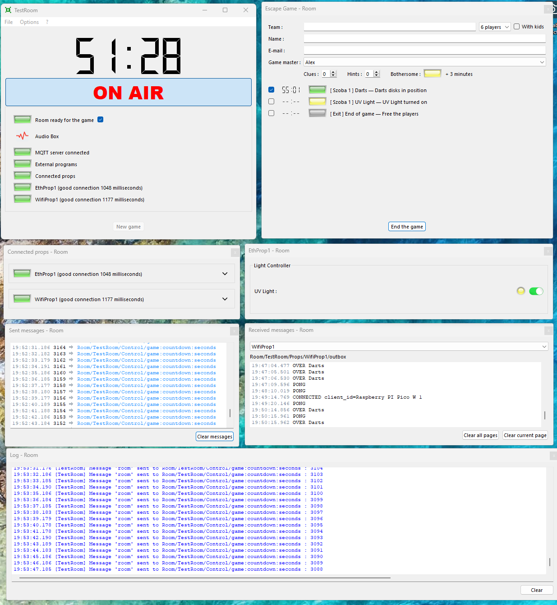

# paniq-room-props

`paniq-room-props` is a [MicroPython](https://micropython.org/) library to program escape room props by microcontrollers with internet capabilites.
The library detects and sets up the networking capabilites of the board (Wifi or Ethernet), makes it to operate as an MQTT client and gives standard programmable endpoints to customise the prop to behieve uniquely on certain MQTT and sensor events.

Supported devices:
* [Raspberry PI Pico W](https://www.raspberrypi.com/products/raspberry-pi-pico/)
* [Wiznet W5100S-EVB-Pico](https://www.wiznet.io/product-item/w5100s-evb-pico/)

## Installation

### 1. Install the correct MicroPython firmware

Different boards require different MicroPython firmwares:
* **Raspberry PI Pico W**: https://micropython.org/download/rp2-pico-w/
* **Wiznet W5100S-EVB-Pico**: https://github.com/Wiznet/RP2040-HAT-MicroPython/releases

Download the correct UF2 file from the list above and install it onto the board:
* Push and hold the `BOOTSEL` button and plug your board into the USB port of other computer. Release the `BOOTSEL` button after your Pico is connected. It will mount as a Mass Storage Device called RPI-RP2.
* Drag and drop the MicroPython UF2 file onto the RPI-RP2 volume. Your Pico will reboot. You are now running MicroPython.

### 2. Edit config

Open the `config.py` file in this repo and change at least the following properties to fit to your environment:

```
# WIFI details for Raspberry PI Pico W
WIFI_SSID = "your-ssid"
WIFI_PASSWORD = "your-secret"

# Ethernet details for Wiznet W5100S-EVB-Pico
# There is no DHCP client in the etnernet driver so you need to specify all interface details
ETH_IP="192.168.1.20"

# IP of your MQTT broker
MQTT_SERVER_HOST="192.168.1.66"
# Make the MQTT client ID unique across all the props
MQTT_CLIENT_ID="Wiznet W5100S-EVB-Pico ETH 1"

# Topics to receive messages from
MQTT_TOPICS_TO_SUBSCRIBE = [
    "Room/TestRoom/Control/game:players",
    "Room/TestRoom/Control/game:scenario",
    "Room/TestRoom/Control/game:countdown:seconds",
    "Room/TestRoom/Props/RandomNumber/inbox",
]

# Topics to send messages to. Make it unique across all the props
MQTT_TOPIC_TO_PUBLISH = "Room/TestRoom/Props/Prop1/outbox"
```

If required set any other detail in the `config.py`.

### 3. Transfer the project files to your board

Transfer the following files and directories to your device with [the Thonny IDE](https://www.freva.com/transfer-files-between-computer-and-raspberry-pi-pico/)
or [without Thonny](https://mikeesto.medium.com/uploading-to-the-raspberry-pi-pico-without-thonny-53de1a10da30).

```
|- lib (dir)
|- paniq_prop (dir)
|- config.py
`- main.py
```

At the next restart the board will connect to the network and will start operating as an MQTT client.

## In Action

Props are compatible with [xcape.io](https://xcape.io/) Room Server.


